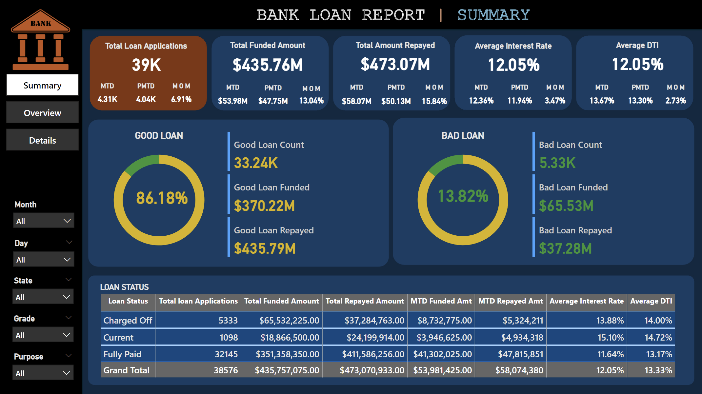
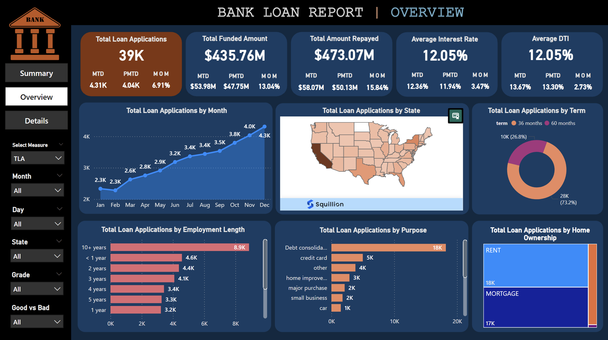
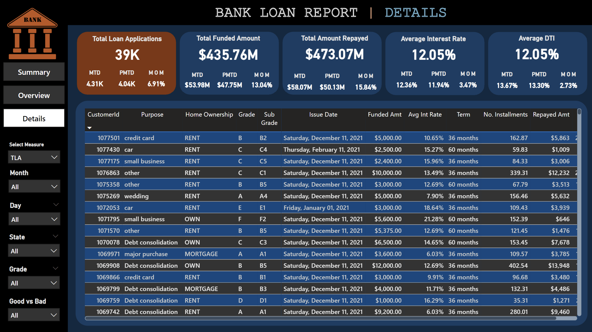

# 🏦 Bank Loan Analysis Dashboard

An in-depth Power BI dashboard designed to analyze bank loan data from January 1, 2021, to December 31, 2021. This project utilizes advanced **DAX (Data Analysis Expressions)** measures to dynamically compute and present key metrics. The dashboard provides actionable insights into total loan applications, funded amounts, repaid amounts, average interest rates, and debt-to-income ratios (DTI), enabling stakeholders to make data-driven decisions.

---

## 📊 Dashboard Overview

### Features:
1. **Summary Page**:
   - Overview of **Good Loans vs Bad Loans**:
     - Good Loan Count, Funded, and Repaid Amounts.
     - Bad Loan Count, Funded, and Repaid Amounts.
   - Loan Status Breakdown: Charged Off, Fully Paid, and Current.
   - Dynamic calculations for **Year-to-Date (YTD)**, **Month-to-Date (MTD)**, **Previous Month-to-Date (PMTD)**, and **Month-over-Month (MoM)** growth.

2. **Overview Page**:
   - Time-series trends of **Total Loan Applications by Month**.
   - Loan Applications by State, Purpose, Employment Length, and Home Ownership.
   - Term-wise loan distribution.

3. **Details Page**:
   - Detailed tabular data for each loan:
     - Customer ID, Purpose, Loan Grade, Term, and Ownership Status.
     - Funded and Repaid Amounts, Average Interest Rates, and Number of Installments.
   - Filtering options by Measure, Month, Day, State, Loan Grade, Purpose, and Ownership Status.

---

## 📋 Key Metrics and DAX Measures

The following measures dynamically compute **YTD**, **MTD**, **PMTD**, and **MoM** values for the selected filters:

### **Major Measures**
1. **Total Loan Applications (TLA)**:
   - YTD_TLA: Total applications from Jan 1, 2021, to Dec 31, 2021.
   - MTD_TLA: Applications in the current month.
   - PMTD_TLA: Applications in the previous month.
   - MoM_TLA: Month-over-Month growth rate.

2. **Total Funded Amount (TFA)**:
   - YTD_TFA: Total amount funded from Jan 1, 2021, to Dec 31, 2021.
   - MTD_TFA, PMTD_TFA, MoM_TFA: Derived measures.

3. **Total Repaid Amount (TRA)**:
   - YTD_TRA: Total amount repaid during the year.
   - Includes breakdown of **good_loan_repayed** and **bad_loan_repayed**.

4. **Average Interest Rate (AIR)**:
   - YTD_AIR: Average interest rate for loans issued during 2021.
   - MTD_AIR, PMTD_AIR, MoM_AIR: Derived measures.

5. **Debt-to-Income Ratio (DTI)**:
   - YTD_DTI: Average DTI for all loans in 2021.
   - MTD_DTI, PMTD_DTI, MoM_DTI: Derived measures.

Each measure dynamically adapts to selected slicers, offering **real-time insights**.

---

## 📊 Screenshots of the Dashboard

### **Summary Page**
This page provides a holistic overview of loan statuses, trends, and distribution of Good and Bad Loans.



### **Overview Page**
An interactive visualization of trends across months, states, loan purposes, and more.



### **Details Page**
A detailed table showing granular data for each loan, with filtering options for all key metrics.



---

## ⚙️ Technologies Used

- **Power BI**: Visualization and dashboard development.
- **DAX (Data Analysis Expressions)**: Advanced calculations for real-time data analysis.
- **Power Query**: Data transformation and preparation.

---

## 📁 File Structure

```plaintext
├── Dashboard/
│   ├── Summary.png      # Screenshot of the Summary page
│   ├── Overview.png     # Screenshot of the Overview page
│   ├── Details.png      # Screenshot of the Details page
├── README.md            # Project documentation
├── DAX_Measures.md    # Full list of DAX measures with interactive navigation
├── Dataset/             # Original dataset (if applicable)
```

---

## 📌 Insights Derived

- **Loan Distribution**:
  - 86.18% of loans are Good Loans, with $370.22M funded and $435.79M repaid.
  - 13.82% of loans are Bad Loans, with $65.53M funded and $37.28M repaid.

- **Trends**:
  - Loan applications steadily increased throughout the year, peaking in December 2021.

- **Geographical Insights**:
  - **California** had the highest loan applications, as seen in the state-wise analysis.

- **Loan Purpose**:
  - **Debt Consolidation** was the most common loan purpose.

- **Financial Metrics**:
  - The average interest rate remained consistent at **12.05%**.
  - The Debt-to-Income Ratio (DTI) averaged at **12.05%** across all loans.

---

## 🛠️ How to Use

1. Clone the repository:
   ```bash
   git clone (https://github.com/Mohamed-Arafaath/Bank_Loan_Analysis)
   ```
2. Open the `.pbix` file in Power BI Desktop.
3. Interact with slicers and filters to explore the data dynamically.
4. View the **DAX Measures** in the Power BI model or refer to the `DAX_Measures.md` file.

---

## 🌟 Conclusion

The **Bank Loan Analysis Dashboard** is a powerful analytical tool for understanding loan data. Its dynamic filters and detailed insights enable financial institutions to identify trends, optimize strategies, and make data-driven decisions.

For further details or questions, feel free to raise an issue or contact me.

---

## 📧 Contact

**Author**: [Mohamed Arafaath]([https://github.com/YourGitHubUsername](https://github.com/Mohamed-Arafaath))  
**Email**: [mohamed_arafaath@outlook.com]
