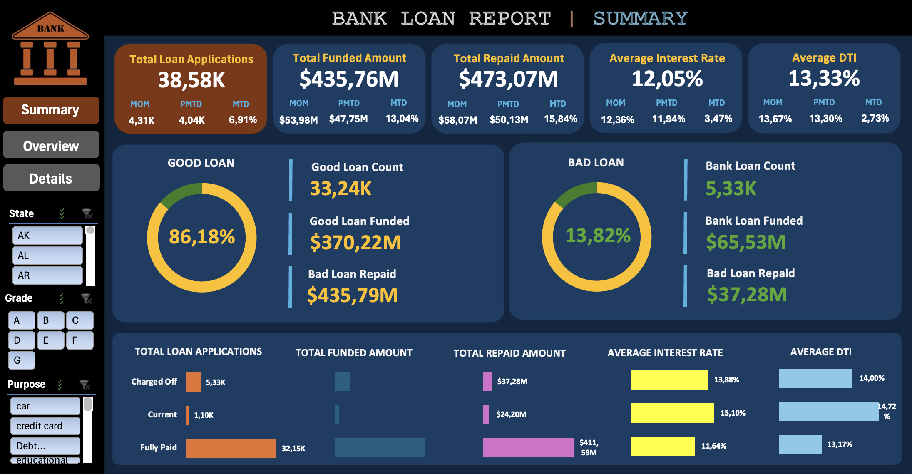
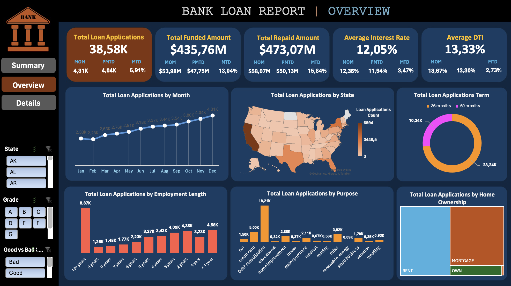
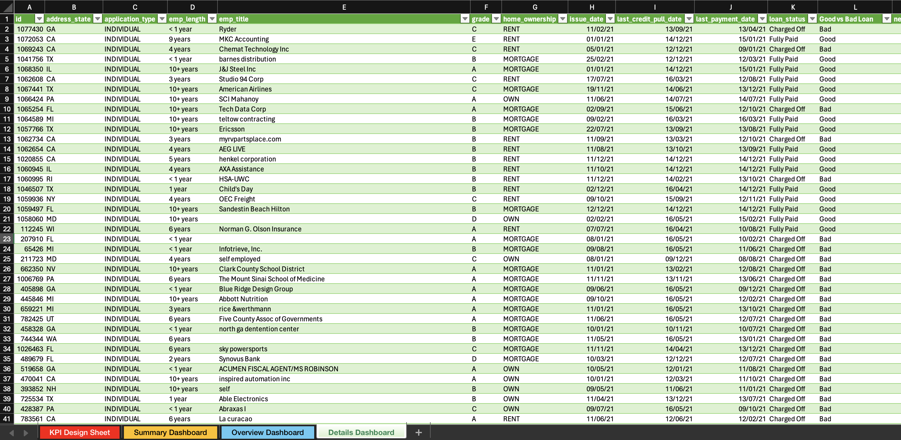

# Excel Dashboard - Bank Loan Analysis

This folder contains the Excel dashboard and related resources for analyzing bank loan data. The dashboard provides insights into loan performance, trends, and key performance indicators (KPIs) based on historical data.

---

## Contents

- **Excel_Dashboard.xlsx**: The main Excel file containing the dashboard with dynamic charts and tables.
- **Screenshots**: A folder containing screenshots of various dashboard views:
  - `Overview.png`: A snapshot of the high-level overview of loan data and KPIs.
  - `Details.png`: A detailed view of loan statistics and breakdowns.
  - `Summary.png`: Summary-level insights from the dashboard.
- **KPI_Design_Sheet**: This sheet in `Excel_Dashboard.xlsx` outlining the design of KPIs and metrics used in the dashboard.

---

## Features

The Excel dashboard includes the following features:

### Key Performance Indicators (KPIs)
1. **Total Loan Applications (TLA)**: The total number of loan applications processed.
2. **Total Funded Amount (TFA)**: The total amount of loans funded.
3. **Total Repaid Amount (TRA)**: The total amount repaid by borrowers.
4. **Average Interest Rate (AIR)**: The average interest rate across all loans.
5. **Average Debt-to-Income Ratio (DTI)**: A measure of borrowers' financial health.

### Monthly Metrics
- **Month-to-Date (MTD)** and **Previous Month-to-Date (PMTD)** values for TLA, TFA, TRA, AIR, and DTI.
- **Month-over-Month (MoM)** percentage changes.

### Loan Performance Analysis
- Breakdown of loans into **Good** and **Bad** categories based on repayment status.
- Loan status categories: Fully Paid, Current, and Charged Off.

### Trends and Insights
- **Monthly Trends**: Loan application trends over the months.
- **State-wise Trends**: Loan applications by state.
- **Employment Length Trends**: Distribution of loans based on borrowers' employment length.
- **Home Ownership Trends**: Analysis of loans based on borrowers' home ownership status.
- **Purpose Trends**: Distribution of loans by purpose (e.g., debt consolidation, home improvement, education).

### Dynamic Filters and Slicers
- Interactive slicers to filter data by loan status, month, and other dimensions.
---

## Screenshots of the Dashboard

### **Summary Page**
This page provides a comprehensive overview of loan statuses, trends, and Good vs Bad Loans.

### **Overview Page**
Visualizes loan trends across time, geography, purpose, and other dimensions.

### **Details Page**
Tabular view of loan-level data.

---

## How to Use
1. **Open the Dashboard**: Download and open `Excel_Dashboard.xlsx` in Microsoft Excel.
2. **Navigate the Sheets**: Explore different sheets to view various visualizations and metrics.
3. **Use Filters**: Utilize slicers and dropdowns to dynamically filter and analyze data.

---

## Data Sources
The analysis is based on anonymized historical loan data. Key columns include:
- Loan Amount
- Interest Rate
- Debt-to-Income Ratio
- Loan Status (e.g., Fully Paid, Charged Off)
- Borrower Details (e.g., employment length, home ownership)

---

## Methodology
1. **Data Preparation**: The raw data was cleaned and transformed to calculate key metrics.
2. **Dashboard Design**: KPIs and trends were visualized using Excel's built-in charting and pivot table features.
3. **KPI Documentation**: Refer to `KPI_Design_Sheet` in `Excel_Dashboard.xlsx` for detailed KPI definitions and calculations.

---

## 📧 Contact

For any questions or feedback, feel free to reach out:

- **Author**: [Mohamed Arafaath](https://www.linkedin.com/in/mohamed-arafaath/)
- **Email**: mohamed_arafaath@outlook.com
