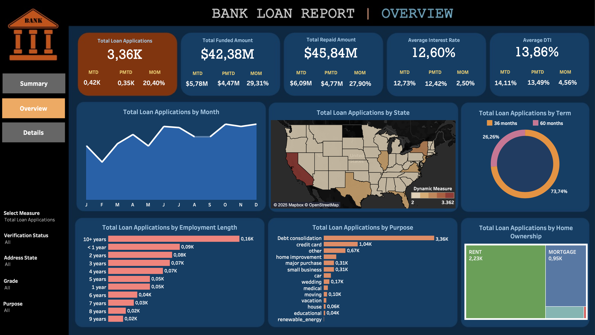

# 🏦 Bank Loan Analysis - Tableau Dashboard

An interactive Tableau dashboard designed to analyze bank loan data for the year 2021. Unlike the dynamic measures used in Power BI, this Tableau dashboard displays **fixed values for the entire year** as the main KPIs, while **MTD**, **PMTD**, and **MoM** calculations are based on **December 31, 2021**, as the current reference point. The dashboard provides actionable insights into total loan applications, funded amounts, repaid amounts, average interest rates, and debt-to-income ratios (DTI), enabling stakeholders to make data-driven decisions.

---

## 📊 Dashboard Overview

### Features:
1. **Filters on All Pages**:
   - Filters available on the **left-hand side** of all three pages:
     - **Verification Status**: Filter loan data by verification status of applicants.
     - **Address State**: Filter loan data by the state in which the applicant resides.
     - **Grade**: Filter loans by their assigned grade (A, B, C, etc.).
     - **Purpose**: Filter loans by the loan purpose (e.g., debt consolidation, home improvement, small business, etc.).

2. **Fixed Date Context**:
   - Main KPIs (e.g., Total Loan Applications, Total Funded Amount) represent the **overall values for the entire year** of 2021.
   - **Month-to-Date (MTD)** is based on **December 31, 2021**.
   - **Previous Month-to-Date (PMTD)** represents values for **November 2021**.
   - **Month-over-Month (MoM)** calculations compare **December 2021** with **November 2021**.

3. **Dashboard Pages**:
   - **Summary Page**: High-level overview of Good vs. Bad Loans and Loan Status Breakdown.
   - **Overview Page**: Trends by month, geography, purpose, employment length, and ownership.
   - **Details Page**: Granular loan-level data with advanced filters.

---

## 📋 Key Metrics and Calculated Fields

The following measures were implemented in Tableau with a **fixed reference context for December 31, 2021**:

### **Major KPIs**:
1. **Total Loan Applications (TLA)**:
   - Total loan applications for the year.
   - Metrics include **MTD**, **PMTD**, and **MoM** calculations.

2. **Total Funded Amount (TFA)**:
   - Total funded amount for the year.
   - Metrics include **MTD**, **PMTD**, and **MoM** calculations.

3. **Total Repaid Amount (TRA)**:
   - Total repaid amount for the year.
   - Metrics include **MTD**, **PMTD**, and **MoM** calculations.

4. **Average Interest Rate (AIR)**:
   - Average interest rate for loans issued in 2021.
   - Metrics include **MTD**, **PMTD**, and **MoM** calculations.

5. **Debt-to-Income Ratio (DTI)**:
   - Average DTI for loans in 2021.
   - Metrics include **MTD**, **PMTD**, and **MoM** calculations.

For detailed calculated fields used in this dashboard, refer to the [`Calculated_Fields&Parameters.md`](./Calculated_Fields&Parameters.md) file in this repository.

---

## 📊 Dashboard Analysis

### **Summary Page Insights**:
- **Good Loans** account for **86.18%**, with a total funded amount of **$370.22M** and a repaid amount of **$435.79M**.
- **Bad Loans** constitute **13.82%**, with a funded amount of **$65.53M** and a repaid amount of **$37.28M**.
- **Loan Status Breakdown**:
  - **Charged Off**: $65.53M funded.
  - **Fully Paid**: $351.36M funded.
  - **Current**: $18.87M funded.

### **Overview Page Insights**:
- **Loan Applications by Month**:
  - Steady growth throughout the year, peaking in December 2021.
- **State-Wise Insights**:
  - **California** leads with the highest loan applications.
- **Purpose Analysis**:
  - **Debt Consolidation** dominates as the primary loan purpose.
- **Employment and Ownership**:
  - Majority of loans issued to individuals with **10+ years of employment**.
  - **Renters** account for a higher share of loan applications compared to homeowners.

### **Details Page Insights**:
- Granular data helps analyze:
  - Individual loan performance.
  - Funding, repayment, and interest rates per loan.

---

## 📊 Screenshots of the Dashboard

### **Summary Page**
This page provides a comprehensive overview of loan statuses, trends, and Good vs Bad Loans.


### **Overview Page**
Visualizes loan trends across time, geography, purpose, and other dimensions.



### **Details Page**
Tabular view of loan-level data with advanced filtering options.


---

## ⚙️ Technologies Used

- **Tableau**: Visualization and dashboard development.
- **Calculated Fields and Parameters**: Advanced formulas for real-time data analysis.
- **Dataset Transformation**: Pre-processed and structured data for visualization.

---

## 📁 File Structure

```plaintext
├── Tableau/
│   ├── Dashboard/
│   │   ├── Summary.png           # Screenshot of the Summary page
│   │   ├── Overview.png          # Screenshot of the Overview page
│   │   ├── Details.png           # Screenshot of the Details page
│   │   ├── Tableau_Dashboard.twb # Tableau workbook
├── Calculated_Fields&Parameters.md # List of calculated fields and parameters
├── README.md                     # Project documentation
```

---

##  📌 SQL Correlation and Insights
This Power BI dashboard mirrors the insights derived from SQL analysis conducted earlier in [`\SQL`](../SQL) folder. The following alignments are observed:

- **Loan Distribution**:
   - SQL insights on Good vs Bad Loans match the 86.18% vs 13.82% split shown here.

- **Geographical Trends**:
   - SQL queries highlighted California as the top state for loan applications, consistent with this dashboard.

- **Debt Consolidation Dominance**:
   - Both SQL and Power BI analyses reveal Debt Consolidation as the primary loan purpose.

- **Monthly Trends**:
   - Steady growth observed in SQL aligns with the Power BI time-series trend.

---

## 🛠️ How to Use

1. Clone the repository:
   ```bash
   git clone (https://github.com/Mohamed-Arafaath/Bank_Loan_Analysis)
   ```
2. Navigate to the Tableau folder and open the Tableau_Dashboard.twb file in Tableau Desktop.
3. Use the filters (e.g., Verification Status, Grade, Purpose) to explore specific data subsets.
4. View the Calculated Fields in the Tableau workbook or refer to the `Calculated_Fields&Parameters.md` file.

---

## 🌟 Conclusion

The **Bank Loan Analysis Dashboard** in Tableau provides a fixed, year-end view of loan performance, along with the flexibility of key filters for deeper insights. Its detailed visualizations empower financial institutions to identify trends, optimize strategies, and make informed decisions.

For further details or questions, feel free to raise an issue or contact me.

---

## 📧 Contact

**Author**: [Mohamed Arafaath](https://www.linkedin.com/in/mohamed-arafaath/)
**Email**: [mohamed_arafaath@outlook.com]


